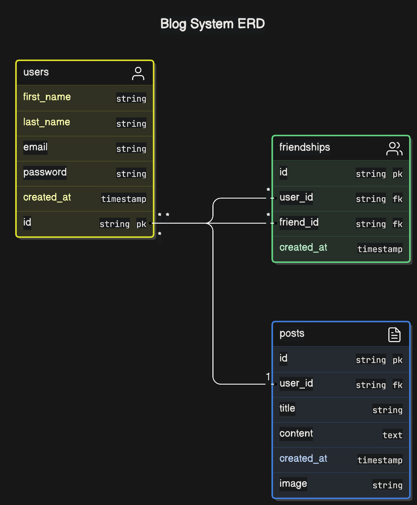

## Couch surfing Blog

This project creates a small blog page with a really simple login page
once a user is authenticated it can see friends's posts on Feed page, there is also My profile page where the user can see their profile basic information and published posts.

User can also see each posts details and other users profiles.

The website is deployed using netlify here: (https://legendary-valkyrie-510089.netlify.app/)

## users

The app has 3 users,but alanmedina@test.com is the one with friendships and can see other users posts the feed

email: alanmedina@test.com pass: password
email: edoTest@test.com pass: password
email: demoTest@test.com pass: password

## Getting Started

Next version : 14.2 (using App Router)

Node version: v18.17.0

Run the development server:

```bash
nvm use # will load the node version from the .nvmrc file if you are using nvm

npm run prepare # will setup husky in the project to allow the use git hooks

npm run dev
# or
yarn dev
# or
pnpm dev
# or
bun dev
```

Open [http://localhost:3000](http://localhost:3000)

## Tech stack

The project is built using TRPC to communicate front end and backend.

I choose TRPC because of the End-to-End type safety

And once you finish the initial boilerplate is really fast to add more endpoint.

The combination with react query makes it really easy to fetch data on client side and manage loading and error state.

Since I'm using App Router from NextJS there's no explicit definition of **getServerSideProps** and **getStaticProps** this version of next manages this functions directly in the page implicitly.

Since the blog posts that show on the feed depends on user friendships I'm not generating all the blogs pages statically, it would be the best option to reduce server side work on request, but it require more time to complete.

## DB

I'm using Turso as a remote db connection and host and drizzle for ORM. Its a simple database to handle posts, users and friendships.



the ids are integer to make it simple to get dummy user images and posts, however UUIDs would be a way better option to mange Ids.

The db data is the **db** folder, here is the definition of schema and connection with turso. the keys are not in the .env file, I send them over email.

## Auth

I wanted to implement a simple auth system using TRPC and **http-only-cookies** to communicate the front and backend , however using **fetchRequestHandler** made it more difficult because it didn't allow to attach the cookie in the response of the login request therefore I wasn't able to share the cookie in TRCP request context in the routers.

The current solution to manage the cookie with the user ID is far from optimal, I'm aware of that, but by the time I realized the **fetchRequestHandler** it was too late to redo the TRCP route strategy to use something more designed for nextjs instead, it would have take another day to redo this part. Just for now the auth flow works creating a normal cookie with the user id, and reading that cookie on client side.

With a bit more time I would have used a library like next-auth to handle authentication is a far more robust solution and can be connected with TRPC.

## Code Flow

I'm using the VS code plugin CODE TOUR to make tours of the flow of the application, you can record each step on a specific flow, like setting up the TRPC communication. IF you install this extension (https://marketplace.visualstudio.com/items?itemName=vsls-contrib.codetour) you can check the flows that work as code and flows documentation. The extension will find the tours recorded and will give a step by step tour of the solution.
